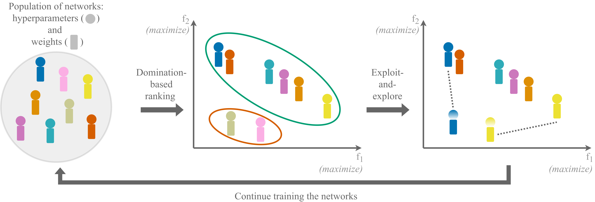
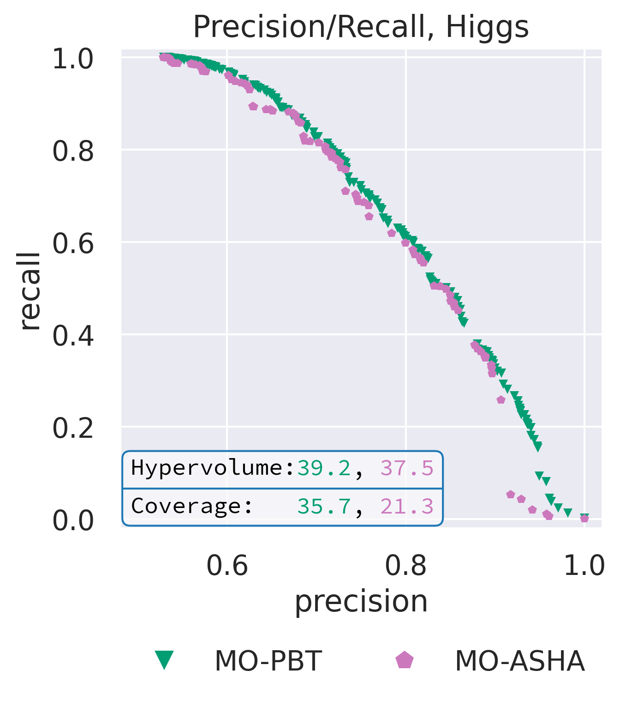

# Multi-Objective Population Based Training (MO-PBT)
The code for the multi-objective hyperparameter optimization algorithm **MO-PBT**:

[Paper](arxiv.org)

[Twitter thread]()



## Dependencies installation:

1.  Creating conda environment named *mopbt*: `conda config --add channels conda-forge &&
conda config --set channel_priority strict &&
conda create -n mopbt --file conda_list.txt &&
source activate mopbt`
2. Installing pip dependencies: `pip install -r pip_list.txt`
3. Installing [pillow-simd](https://github.com/uploadcare/pillow-simd) for faster image processing:
`pip uninstall -y pillow pil jpeg libtiff libjpeg-turbo &&
conda install -yc conda-forge libjpeg-turbo &&
CFLAGS="${CFLAGS} -mavx2" pip install --upgrade --no-cache-dir --force-reinstall --no-binary :all: --compile pillow-simd`

## Downloading data
- CIFAR-10/100 and CelebA datasets are downloaded automatically by [torchvision](https://pytorch.org/vision/stable/datasets.html)
- Click Prediction dataset is downloaded automatically by [OpenML](https://www.openml.org/search?type=data&sort=runs&status=active)
- Adult and Higgs datasets can be downloaded from the [link](https://www.dropbox.com/s/o53umyg6mn3zhxy/data.tar.gz?dl=1) following the [FT-Transformer paper](https://github.com/Yura52/tabular-dl-revisiting-models)

## Running experiments
To run an algorithm: `python3 run_algorithms.py --config=[config_name].yaml`

For example, to run MO-PBT on the Precision/Recall task on the Adult dataset (details are in the paper): `python3 run_algorithms.py --config=configs_mopbt/config_precision_recall.yaml`

Detailed instructions about config format and parameters are provided in the config files.

### Notes
- The number of parallel workers (networks trained in parallel) per GPU is defined by the parameter  `parallel_workers_per_gpu` (we used 4).
- The code produces quite a lot of elaborate logging information, it is recommended to use file redirection (e.g., `> logs.txt`) to check later how the search proceeded.

### Collecting results
Each run of an algorithm collects its own folder named ```[logs_path]/[name]/[run]```, where:
- *logs_path* is defined in the config file
- *name* is automatically generated using algorithm configuration (generation is specified in the `out_name_template` parameter in the config
- *run* is the number of the run

This folder contains:
- The config file of this run
- Folder *results*. It contains .json files with the logged progress of all individuals of the population (see details below).
- [Optional, if the argument `keep_all_files` in the config exists and is set to *True*] Folder *models* which contains all models trained during the search process.

### Files with performance logs for all individuals (*.json* format)
- Keys of this json are the epoch numbers at which the model was evaluated
- At each epoch of evaluation the following information is logged:
    - Wall-clock time when the evaluation was performed
    - Validation score (for all objectives)
    - Test score (for all objectives)
    - Model hyperparameters at the time of evaluation (a dictionary with variable names as the keys)

### Evaluating performance
Example of results collection and processing is provided in [Jupyter Notebook](results_visualization.ipynb):



## Bibtex
```

```
